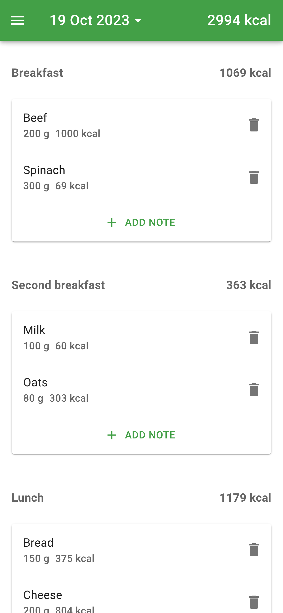
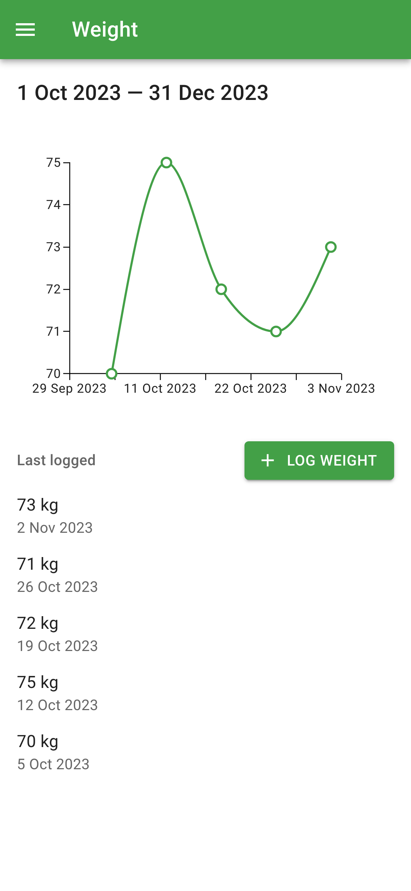
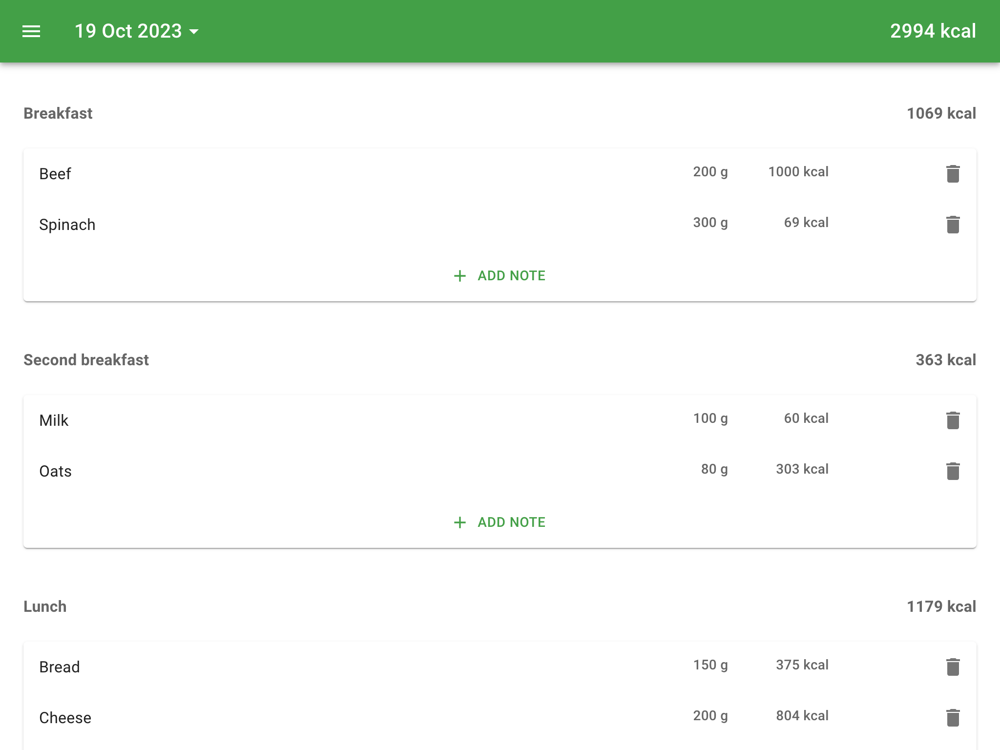

# Food Diary

[](https://github.com/pkirilin/food-diary/actions/workflows/build.yml)

Food Diary is a free, open-source, and lightweight web app for nutrition and weight tracking. It was initially created in 2018 to help [the author](https://github.com/pkirilin) address personal health challenges caused by being overweight.

While it doesn't fully replace popular commercial nutrition and weight tracking apps, Food Diary offers essential features as a free alternative for people who care about their health and well-being.

Curious to see how the app works? [View the demo app here](https://pkirilin-food-diary-demo.netlify.app/).

## Table of contents

- [Food Diary](#food-diary)
  - [Table of contents](#table-of-contents)
  - [Features](#features)
  - [Installation](#installation)
  - [Development](#development)
    - [Setting up the entire app (Frontend and Backend)](#setting-up-the-entire-app-frontend-and-backend)
    - [Setting up Frontend with mocked auth and API](#setting-up-frontend-with-mocked-auth-and-api)
      - [Frontend environment variables](#frontend-environment-variables)
    - [Managing database migrations](#managing-database-migrations)
  - [Contacts](#contacts)
  - [Copyright](#copyright)
    - [Favicon](#favicon)
  - [License](#license)

## Features

- Nutrition tracking: calories, protein, fats, carbs, sugar, and salt
- Personal food database with nutrition values for each product
- Weight tracking
- PWA and multi-device support
- AI-powered food recognition from photos

<table>
  <tr>
    <td>
      
    </td>
    <td>
      
    </td>
  </tr>
  <tr>
    <td colspan="2">
      
    </td>
  </tr>
</table>

## Installation

Clone the repository:

```shell
git clone https://github.com/pkirilin/food-diary.git
cd food-diary
```

Setup [Google OAuth 2.0 client](https://support.google.com/cloud/answer/6158849) you will use for sign in:

- Add Authorized JavaScript origins: <https://localhost:8080>
- Add Authorized redirect URIs: <https://localhost:8080/signin-google>

Create a copy of `.env.example` file and save it as `.env`:

```shell
cat .env.example >> .env
```

Fill your credentials, then run:

```shell
docker-compose up -d
```

Navigate to <https://localhost:8080>

## Development

### Setting up the entire app (Frontend and Backend)

Before starting, ensure you have the following installed on your machine:

- [Docker](https://www.docker.com/)
- [.NET SDK](https://dotnet.microsoft.com/en-us/download) (8.0.0 or higher)
- [Node.js](https://nodejs.org/en) (22 or higher)
- [yarn](https://yarnpkg.com/getting-started/install)

Start PostgreSQL database container:

```shell
docker run -p 5432:5432 --name postgres \
    -e POSTGRES_USER=postgres \
    -e POSTGRES_PASSWORD=postgres \
    -e POSTGRES_DB=FoodDiary \
    -d postgres:15.1-alpine
```

*Start PgAdmin if you need it (optional):*

```shell
docker run -p 5050:80 --name pgadmin -e "PGADMIN_DEFAULT_EMAIL=name@example.com" -e "PGADMIN_DEFAULT_PASSWORD=postgres" -d dpage/pgadmin4
```

Fill necessary secrets:

```shell
dotnet user-secrets --project src/backend/src/FoodDiary.API set "Auth:AllowedEmails:0" "<your_email>@gmail.com"

dotnet user-secrets --project src/backend/src/FoodDiary.API set "ConnectionStrings:Default" "<your_db_connection_string>"

# Optional, used in recognize note by photo feature
dotnet user-secrets --project src/backend/src/FoodDiary.API set "Integrations:OpenAI:ApiKey" "<your_OpenAI_api_key>"
```

Run database migrations:

```shell
dotnet run --project src/backend/src/FoodDiary.Migrator
```

Start Web API:

```shell
dotnet run --project src/backend/src/FoodDiary.API
```

Start frontend application (in separate terminal window):

```shell
cd src/frontend
yarn start
```

Navigate to <https://localhost:8080>

### Setting up Frontend with mocked auth and API

If you'd like to work on the frontend without running the backend, you can use mocked authentication and API responses.

Before starting, ensure you have the following installed on your machine:

- [Node.js](https://nodejs.org/en) (22 or higher)
- [yarn](https://yarnpkg.com/getting-started/install)

Navigate to the frontend directory:

```shell
cd src/frontend
```

Create local env config:

```shell
touch .env.local
```

Fill `.env.local` with these values:

```text
VITE_APP_MSW_ENABLED=true
VITE_APP_FAKE_AUTH_ENABLED=true
VITE_APP_FAKE_AUTH_LOGIN_ON_INIT=true
```

For the full list of environment variables, see the [Frontend environment variables](#frontend-environment-variables) section.

Launch the frontend application:

```shell
yarn start
```

Navigate to <http://localhost:5173>. The app will now use mocked responses for authentication and API calls.

#### Frontend environment variables

The following environment variables are available for configuring the frontend:

Name                                       | Type      | Description
-------------------------------------------|-----------|------------------------------------------------------------------------------------------------------------------------------------------------------------------------------------------------------------------------------------------
`VITE_APP_API_URL`                         | `string`  | Specifies a backend API base URL without a trim slash, e.g. `https://localhost:8080`
`VITE_APP_AUTH_CHECK_INTERVAL`             | `number`  | Specifies the auth status check interval in milliseconds to ensure that users with expired cookies will not be able to use the application without refreshing the page in the browser. Not used if `VITE_APP_FAKE_AUTH_ENABLED` is `true`
`VITE_APP_DEMO_MODE_ENABLED`               | `boolean` | Enables demo mode. In demo mode, some features related to file system or external integrations are disabled
`VITE_APP_FAKE_AUTH_ENABLED`               | `boolean` | Setups fake authentication flow without using a backend server and OAuth Identity provider. Used for local development
`VITE_APP_FAKE_AUTH_LOGIN_ON_INIT`         | `boolean` | Defines whether the user is authenticated by default when using a fake authentication flow. Used for local development
`VITE_APP_MSW_ENABLED`                     | `boolean` | Enables mockServiceWorker to intercept and mock all API requests. Used for testing or local development purposes
`VITE_APP_GOOGLE_ANALYTICS_ENABLED`        | `boolean` | Enables Google Analytics
`VITE_APP_GOOGLE_ANALYTICS_MEASUREMENT_ID` | `string`  | Measurement (data stream) ID for Google Analytics
`VITE_APP_MOCK_API_RESPONSE_DELAY` | `number` | Sets delay (in milliseconds) before all mock API responses. Not used if `VITE_APP_MSW_ENABLED` is `false`

### Managing database migrations

To create a new migration, run the following command:

```shell
dotnet ef migrations add SampleMigrationName \
    -s src/backend/src/FoodDiary.API \
    -p src/backend/src/FoodDiary.Infrastructure \
    -o Migrations
```

## Contacts

For any issues, suggestions, questions, or contribution guidance, please open a GitHub issue or reach out to [kirilin.pav@gmail.com](mailto:kirilin.pav@gmail.com).

## Copyright

### Favicon

This favicon was generated using the following graphics from Twitter Twemoji:

- Graphics Title: 1f96c.svg
- Graphics Author: Copyright 2020 Twitter, Inc and other contributors (<https://github.com/twitter/twemoji>)
- Graphics Source: <https://github.com/twitter/twemoji/blob/master/assets/svg/1f96c.svg>
- Graphics License: CC-BY 4.0 (<https://creativecommons.org/licenses/by/4.0/>)

## License

The project is licensed under the AGPLv3. See the [LICENSE](LICENSE) file for more information.
