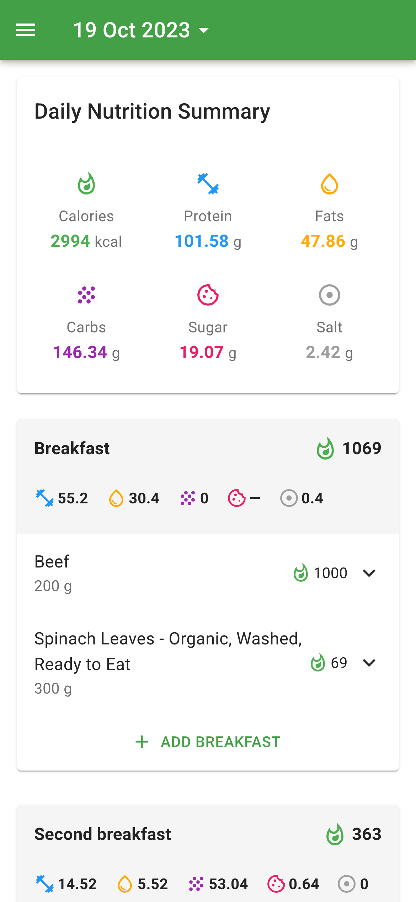
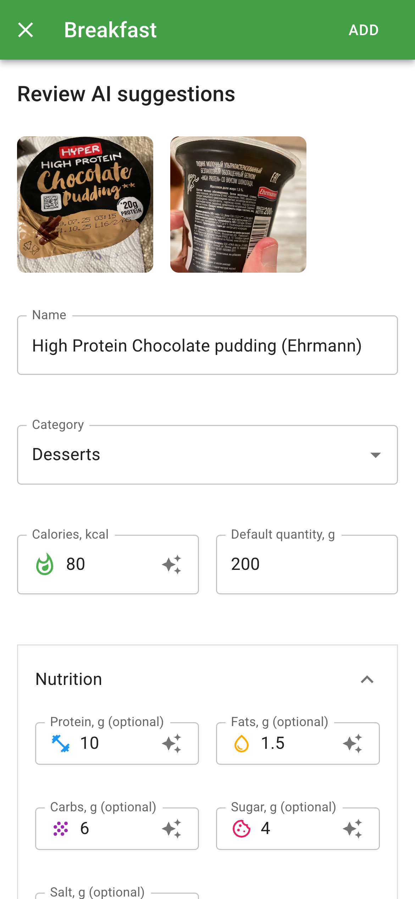
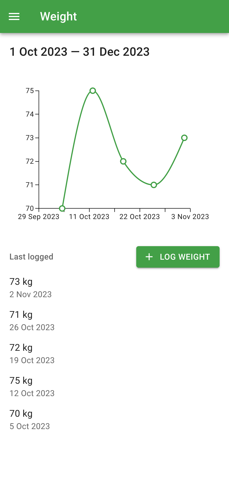
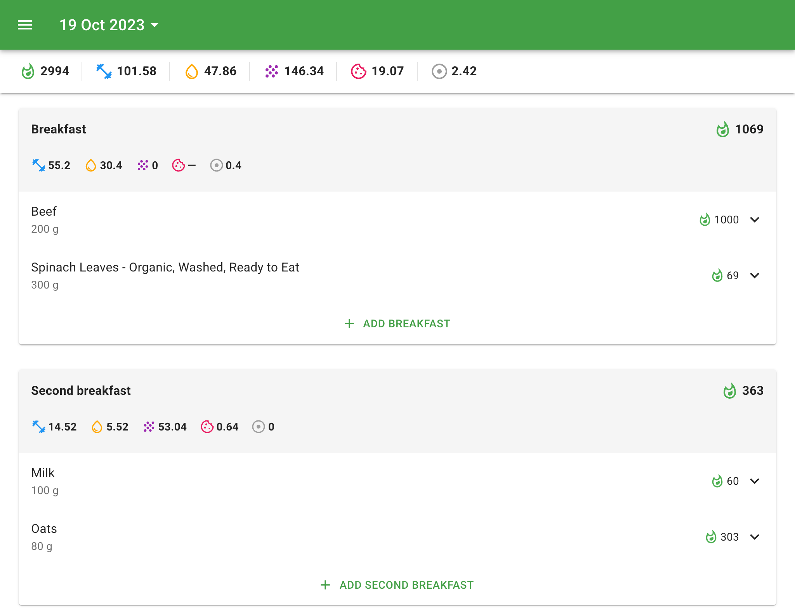

# Food Diary

Food Diary is a free, open-source web app for tracking what you eat and what you weigh. It was created in 2018 to help [its author](https://github.com/pkirilin) deal with health problems caused by being overweight.

Why use it:

- **Instant daily totals.** Log what you eat and immediately see your calories, protein, fats, carbs, sugar and salt for the day. Paper can't do that.
- **Your data stays yours.** It runs on your own server. No subscription, no ads, no account with anyone else.
- **Only the essentials.** Food logs, your own product list and weight tracking, plus AI that fills in nutrition values from a photo and read-only access for Claude or any other MCP client.

**You run your own copy.** There is no hosted version to sign up for. You need a server or container platform that runs Docker, a Google account to sign in with, and a domain with HTTPS to use it anywhere other than the machine it runs on.

What it doesn't do:

- No barcode scanning
- No shared database of foods — you add the products you eat yourself
- No calorie or macro goals
- No exercise or activity tracking
- No syncing with fitness trackers
- One person per install; no social or sharing features
- No app-store app — install it from the browser as a [PWA](https://developer.mozilla.org/en-US/docs/Web/Progressive_web_apps)

## Quick start

**[Try the demo](https://pkirilin.github.io/food-diary/)** — it runs in your browser against sample data, with no server behind it. Features that need a server, like AI photo recognition, are turned off.

To run your own copy:

1. [Get a server and a domain](docs/guide/deployment.md#what-you-need).
2. [Set up Google sign-in](docs/guide/deployment.md#set-up-google-sign-in).
3. [Download `compose.yml` and `.env.example`](docs/guide/deployment.md#option-a-vps-with-docker-compose), copy `.env.example` to `.env` and fill it in.
4. Run `docker compose up -d` and open `https://<your-domain>`.

## Features

- 🥗 Nutrition tracking: calories, protein, fats, carbs, sugar, and salt
- 🗂️ Personal food database with nutrition values for each product
- ⚖️ Weight tracking
- 📱 PWA and multi-device support
- 📸 AI-powered food recognition from photos
- 🤖 Read-only access for LLMs through an MCP connector

<table>
  <tr>
    <td>
      
    </td>
    <td>
      
    </td>
    <td>
      
    </td>
  </tr>
  <tr>
    <td colspan="3">
      
    </td>
  </tr>
</table>

## MCP server

Connect Claude, or any other compatible MCP client, to your Food Diary and ask it what you ate last week or how your protein intake is trending. Access is read-only and off by default; see the [MCP server guide](docs/guide/mcp-server.md).

## Self-hosting

The [deployment guide](docs/guide/deployment.md) covers running Food Diary on a VPS with Docker Compose or on a container platform, the full configuration reference, updating, and backups.

## Browser support

The app runs in these browsers and later:

Browser                | Minimum version
-----------------------|----------------
Chrome                 | 117
Edge                   | 121
Firefox                | 121
Safari (macOS)         | 17.0
Safari (iOS) / iPadOS  | 17.0

These are the floors of [MUI v9](https://mui.com/material-ui/getting-started/supported-platforms/), the component library the frontend is built on.

## Contributing

See [CONTRIBUTING.md](CONTRIBUTING.md) for development setup, the release process, and where to ask questions.

## License

The project is licensed under the AGPLv3. See the [LICENSE](LICENSE) file for more information.

Credits: the favicon is [Twemoji `1f96c`](https://github.com/twitter/twemoji/blob/master/assets/svg/1f96c.svg), © 2020 Twitter, Inc and other contributors, licensed under [CC-BY 4.0](https://creativecommons.org/licenses/by/4.0/).
